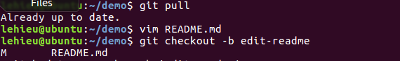
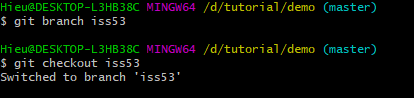
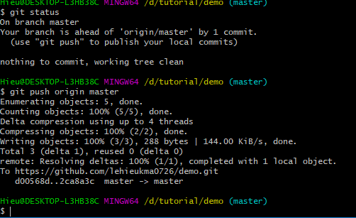
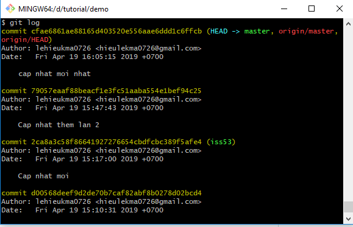

# GIT và GITHUB
## I.GIT là gì ?
- Git là một trong những Hệ thống Quản lý Phiên bản Phân tán, vốn được phát triển nhằm quản lý mã nguồn (source code) hữu hiệu của Linux.
- Trên Git, có thể lưu trạng thái của file khi có nhu cầu dưới dạng lịch sử cập nhật. Vì thế, có thể đưa file đã chỉnh sửa một lần về trạng thái cũ hay có thể
 hiển thị sự khác biệt ở nơi chỉnh sửa.
- Github là một trang web, cho phép bạn lưu source code của mình lên đó. Sự kết hợp hoàn hảo giữa Git và Github mang lại một sự thuận tiện không hề nhỏ cho người dùng. 
Bạn có thể thay đổi đoạn code của mình mọi lúc mọi nơi mà không sợ bị ghi đè lên hay bị mất dữ liệu do hỏng hóc vì dữ liệu của bạn được lưu cả trên trang web Github và máy cá nhân. 
Bạn cũng có thể khôi phục được code của mình về một thời điểm bất kỳ nào đó.
- Github có bản free và mất phí. Với Github free thì source code của bạn sẽ công khai, có nghĩa là ai cũng có thể xem code của bạn. Nó phù hợp với các phần mềm nguồn mở, 
và cũng có thể trở thành một blog cá nhân của chính các bạn như các trang blogspot, wordpress,...
- Repository là nơi sẽ ghi lại trạng thái của thư mục và file. Trạng thái được lưu lại đang được chứa như là lịch sử thay đổi của nội dung. Bằng việc đặt thư mục muốn 
quản lý lịch sử thay đổi dưới sự quản lý của repository, có thể ghi chép lại lịch sử thay đổi của thư mục và file trong thư mục đó.
- Có 2 loại repository :
	- Remote repository: Là repository để chia sẻ giữa nhiều người và bố trí trên server chuyên dụng.
	- Local repository: Là repository bố trí trên máy của bản thân mình, dành cho một người dùng sử dụng.
### a. Push lên git
- Để chia sẻ lịch sử thay đổi của local repository mà bản thân đang có bằng remote repository, cần phải upload lịch sử thay đổi trong local repository.
Vì thế, sẽ thực hiện thao tác gọi là Push trên Git. Khi thực hiện Push, lịch sử thay đổi của bản thân sẽ được upload lên remote repository 
và lịch sử thay đổi của remote repository sẽ có trạng thái giống với local repository.
### b. Clone
- Để sao chép remote repository, sẽ thực hiện thao tác gọi là "clone".
Khi thực hiện Clone, sẽ tải về toàn bộ nội dung của remote repository, và có thể tạo thành local repository ở máy khác.
### c. Pull
- Để cập nhật local repository từ remote repository thì thực hiện thao tác gọi là Pull.
Khi thực hiện Pull, sẽ tải lịch sử thay đổi mới nhất từ remote repository về, rồi đưa nội dung đó vào local repository của bản thân.
### d. Branch
- Branch là cái dùng để phân nhánh và ghi lại luồng của lịch sử. Branch đã phân nhánh sẽ không ảnh hưởng đến branch khác nên có thể 
tiến hành nhiều thay đổi đồng thời trong cùng 1 repository.
Hơn nữa, branch đã phân nhánh có thể chỉnh sửa tổng hợp lại thành 1 branch bằng việc hợp lại (merge) với branch khác.
- Brach master :
Khi tiến hành commit lần đầu trong repository thì Git sẽ tạo ra một branch có tên là master. Vì thế những lần commit sau sẽ được thêm vào
 branch master cho đến khi chuyển đổi branch.
- Có 2 loại brach là brach chủ đề (Integration branch) và 
brach tích hợp (Topic branch). 
	- Topic branch :Topic branch là branch tạo ra nhằm tiến hành công việc liên quan đến chủ đề như là chỉnh sửa lỗi hay là thêm chức năng. Khi tiến hành cùng lúc những công việc 
	có liên quan đến nhiều chủ đề thì số lượng branch chủ đề tương ứng sẽ được tạo ra.
	- Intergration branch : Intergration branch là branch có thể tạo ra bản phát hành bất cứ khi nào. Hơn nữa, nó cũng được sử dụng như là nguồn phân branch của topic branch.
	Vì thế, việc duy trì trạng thái ổn định là điều cần thiết.
## II . Vận dụng
### 1.Cơ bản : Tạo github repository và clone,pull và push đơn giản.
### a. Tạo github repository và clone
- Tạo github repository bằng cách truy cập github.com tạo 1 tài khoản đề bắt đầu và tạo repository giống với hình bên dưới.

- Clone từ github về máy của bạn : 

- Kết quả clone thành công :

### b.Push và pull
- Push 1 file text.txt lên github :

- Push thành công lên github :


- Pull từ repository :

- Chỉnh sửa nội dụng trong file text.txt sau đó push


- Nội dung mới đã được push lên repository
- Xem lại nhật kí đã thay đổi của repository :

### 2.Branch,Merge
### a.Tạo branch và thực hiện trên branch
- Ta tạo 1 branch tên là branch mới,tạo 1 file trên branch là text2.txt.

- Chỉnh sửa file text2.txt trên branch mới tạo tên là branch-moi:

- Push file lên remote,trong mục branch có 1 branch tên là branch-moi được cập nhật khi push file text2.txt lên git

- Khi pull về, ta nhận thấy đã có 2 branch là branch master và branch mới :

- Tiếp theo thực hiện git merge để đồng bộ từ branch-moi vào branch master : 

- Trên github, ta nhận thấy được điều đó : text2.txt đã được merge vào branch master

### b.	Tới phần Pull Request :
-1 người dùng pull về  :

- Thực hiện chỉnh sửa file README.md,sau đó push lên remote :

- Ở trên remote nhận được thông báo pull request:

- Nhấn vào pull request,ở đây hiện ra những thay đổi mà người dùng đã chỉnh sửa :

- Khi đấy sẽ để lại lời nhắn nhờ người quản trị branch master merch giúp :

-	Khi này người quản trị branch master sẽ request lại :

- Trả lời lại đồng ý hoặc không đồng ý hoặc thêm ý kiến chỉnh sửa,khi đấy bên người dùng sẽ nhận được :

- Chấp nhận merge nhấn confirm merge để duyệt :

- Sau đó thực hiện xóa khi đã chấp nhận merge :

- Kết quả thành công :

### c. Reset commit
- Đầu tiên ta thực tiện tạo file touch3.txt :

- Xem git log thấy có thông báo add file :

- Có 2 kiểu reset là rest-soft và reset-hard :


- Reset-soft là  chỉ di chuyển HEAD về vị trí commit. Trạng thái của stage và tất cả sự thay đổi của file sẽ được giữ nguyên.
- Reset hard là xóa luôn thay đổi trên local demo
- HEAD^1 là reset từ HEAD local về commit trước đó. 
### 5. Issues
- Giả sử bạn đang theo dõi repo của tôi và thấy có một số chỗ cần sửa đổi, bạn có thể comment ý kiến của mình vào Repo đó. 
Sau đó người quản trị sẽ xem xét, thay đổi và trả lời bạn.
- Để làm việc này bạn cần vào repo đó, click vào Issue. Ví dụ như hình sau:

- Lúc này tại Repo của người quản trị sẽ thấy một Issue mới, người quản trị có thể click vào Issue này để xem, 
sau đó xem xét sửa đổi, comment lại. Khi sửa đổi hoàn tất thì sẽ đóng issue đó lại.

- Bằng cách tạo issue, bạn có thể đăng các câu hỏi, thắc mắc của mình cho chủ của repo đó.
### 6. Thao tác với tổ chức trong Github
- Để tạo một nhóm cho nhiều người cùng làm việc ta làm như sau:
	- Truy cập URL: https://github.com/settings/organizations, chọn New Organizations
	- Đặt tên và email cho tổ chức

- Tại mục `Choose the organization’s plan` chọn Open Source để miễn phí, nhưng lúc này các Repo trong tổ chức sẽ là public.
	- Mời các thành viên cho tổ chức

- Khi tạo thành công 

- Ở đây ta tạo 1 nhóm mới :

- Để mời một người dùng khác vào team, ta click vào team đó và search tên của người dùng cần tìm

### 7.Lệnh checkout
- Để hiểu được lệnh git checkout thì ta phải hiểu được về phân nhánh và tích hợp.
- Đầu tiên, giả sử bạn đang làm việc trên một dự án đã có một số commit từ trước

- Để cho rõ ràng, Git không cung cấp kèm bất kỳ hệ thống giám sát vấn đề nào.nhưng bởi vì vấn đề số #53 là cái mà bạn sẽ tập trung
vào nên bạn sẽ tạo một nhánh mới để làm việc trên đó. Để tạo một nhánh và chuyển sang nhánh đó đồng thời, bạn có thể chạy lệnh git checkout

- Ví dụ :
- Đầu tiên ta có 1 file sample.txt :

- Ta tạo 1 nhánh branch mới tên là iss53 :

- Chỉnh sửa file sample.txt trên branch iss53 :

- Sau đó ta checkout ra branch master rồi gộp branch iss53 vào branch master :

- Sau đó cập nhật lên github 

### 8.Lệnh git revert 
- Ta sử dụng git revert để xóa bỏ trạng thái của 1 vài commit trước đó :
- Câu lệnh :
``` git revert <commit_ID> ```
- Ví dụ :
- Ta xem log :

- Ta dùng lệnh :`git revert HEAD`.Kết quả :


### 9.Lệnh git reset
- Lệnh git reset ta chủ yếu quan tâm đến git reset,git reset-hard , git reset -- soft
``` git reset ```
	- Di chuyển HEAD về vị trí commmit reset và vẫn giữ nguyên tất cả các thay đổi của file, nhưng loại bỏ các thay đổi khỏi stage.
``` git reset --hard ```
- Di chuyển con trỏ HEAD về vị trí commmit reset và loại bỏ tất cả sự thay đổi của file sau thời điểm commit reset.
``` git reset --soft ```
- Lệnh này chỉ di chuyển HEAD về vị trí commit. Trạng thái của stage và tất cả sự thay đổi của file sẽ được giữ nguyên.
Ví dụ :
- Ta cũng xem log giống như trên, sau đó dùng lệnh get reset về vị trí commit_ID đã chọn

```
Về 3 lệnh trên, ta tổng kết được như sau :
Về Git checkout ta nói đơn giản là khi tạm thời ta sử dụng 1 commit mới,ta thực hiện tạo 1 nhánh khác ra để xử lí công việc khác,
khi thực hiện xong rồi ta merge lại brach master
Về Git revert, ta có thể thực hiện về commit trước bằng câu lệnh git revert để xóa bỏ trạng thái của commit trước đó,các commit_ID bị chỉ định bị xóa bỏ
còn những commit_ID không bị chỉ định vẫn được giữ nguyên
Về Git reset, ta có 3 git reset chủ yếu được sử dụng và được nói ở trên, khác với git revert thì git reset có thể loại bỏ tất cả các sự thay đổi của file
sau thời điểm commit reset bằng câu lệnh reset -- hard
```