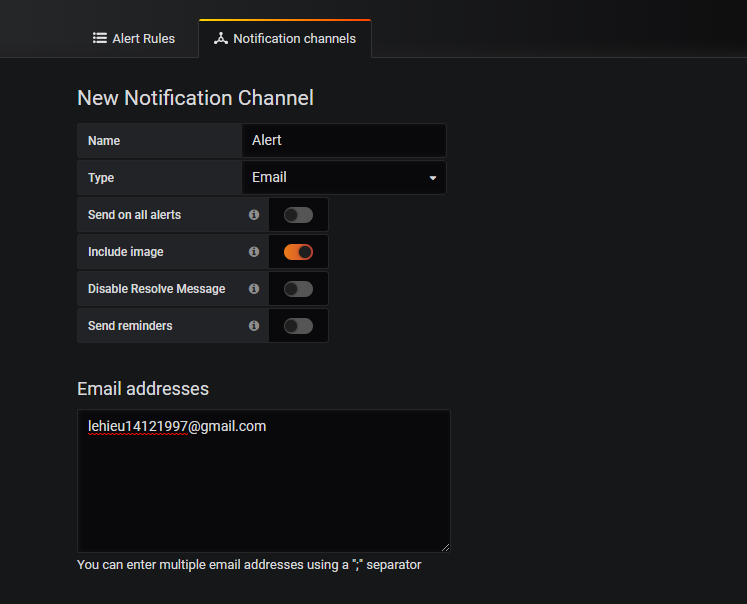

# Mô hình Graph monitor (Grafana + InfluxDB + Telegraf)
## I.Cài đặt grafana,InfluxDB,Telegraf
- Ở đây ta cài đặt grafana,influxDB,telegraf trên CentOS 7. Dưới đây sẽ là mô hình mà chúng ta cài đặt để thực hiện 


- **Grafana** là công cụ được tin tưởng và yêu thích bởi cộng đồng, là nền tảng phân tích tất cả các loại metric.
- **Grafana** cho phép truy vấn, visualize (hiển thị), cảnh báo và giúp bạn hiểu metric dù chúng được lưu ở bất kì đâu. Tạo, khám phá và chia sẻ dashboard với nhóm của bạn và thúc đẩy văn hóa luồng dữ liệu.
- **Telegraf** là một agent để collecting và reporting metrics và data được viết bởi Go.Nó có thể tích hợp để collect nhiều loại nguồn dữ liệu khác nhau của metrics, events, và logs trực tiếp từ containers và system mà nó chạy trên đó
- **InfluxDB** là một **Time Series Database** (là database được tối ưu hóa để xử lý dữ liệu chuỗi thời gian, các dãy số được lập chỉ mục theo thời gian. )
- **InfluxDB** được sử dụng để lưu các dữ liệu cho các trường hợp liên quan đến một lượng lớn time-stamped data, bao gồm DevOps monitoring, log data, application metrics, IoT sensor data, và real-time analytics. Nó có thể tự động xóa các dữ liệu cũ, không cần thiết và cung cấp một ngôn ngữ giống SQL để tương tác với dữ liệu.

## Cài đặt InfluxDB, Telegraf và Grafana
### InfluxDB :


```
wget https://dl.influxdata.com/influxdb/releases/influxdb-1.6.0.x86_64.rpm
yum -y locatlinstall influxdb-1.6.0.x86_64.rpm
systemctl start influxdb
systemctl enable influxdb
```
### Telegraf :


```
wget https://dl.influxdata.com/telegraf/releases/telegraf-1.7.2-1.x86_64.rpm
yum -y localinstall telegraf-1.7.2-1.x86_64.rpm
systemctl start telegraf
systemctl enable telegraf
```
### Grafana :


```
wget https://s3-us-west-2.amazonaws.com/grafana-releases/release/grafana-5.2.2-1.x86_64.rpm
yum -y install initscrippts fontconfig
systemctl daemon-reload
systemctl enable grafana-server.service
systemctl start grafana-server.service
```

## II . Cấu hình

### Cấu hình influxDB :
- Thiết lập username và password trong influxDB. 


Ở đây tạo user là lehieu và pass là 123.

### Cấu hình telegraf :
- Ta vào thư mục telegraf.conf và chỉnh sửa trên tệp tin :

- Ta cần chú ý tới url =  [“htttp://localhost:8086”] là địa chỉ truy cập của influxdb

database là telegraf.


- Tài khoản và mật khẩu ta tạo ở trên influxDB để khi khởi động influxDB thì telegraf có thể tiến hành đấy metric lên influxDB thông qua cổng 8086
- Sau đó restart lại influxDB và telegraf
- Update repository trên máy và cài đặt Grafana:
```
apt-get update -y
apt-get install grafana -y
```
- File cấu hình cài đặt của grafana thường ở file `:/etc/grafana/grafana.ini `
Chạy lệnh sau để khởi động grafana cùng hệ thống:
`systemctl enable grafana-server.service`

- Ở đây ta thực hiện quá trình kiểm tra trên telegraf bằng câu lệnh `show measurements` để thực hiện việc kiểm tra xem từ influxDB đã đẩy metric vào telegrat hay chưa

- Tiếp theo ta tiếp tục kiểm tra xem dạng metric đã được gửi vào thành công trên telegraf để kiểm tra data xem trong quá trình tiếp theo trên grafana sẽ hiển thị dữ liệu có trùng khớp với dữ liệu được gửi lên hay không !

- Ở đây ta kiểm tra ở cpu bnagwf câu lệnh `select*from cpu limit 2` để hiển thị ra 2 dòng được hiển thị trên cpu
- Ở phần tiếp theo ta thực hiện trên grafana sẽ hiển thị thông tin của CPU và ta sẽ so sánh lại giá trị ở đây xem có trùng khớp  không .
## III . Thực hiện trên grafana :
- Truy cập Grafana trên trình duyệt http://ip_add:3000. Login user admin and pass admin .
Khi đấy sẽ vào Home Dashboard tiến hành add data source

- Ở đây ta tiến hành điền thông tin ở các trường, ở phần user và pass thì điền user+pass đã tạo trên influxDB. Sau đấy save lại ta sẽ nhận được thông báo dữ liệu InfluxDB đã được thêm vào máy chủ Grafana.
- Hiện có các kiểu panel: Graph, Singlestat, Dashlist, Table và Text, …

- Query Editor cho thấy khả năng của DS và cho phép truy vấn các metric mà nó chứa. Sử dụng Query Editor để dựng lên một hoặc nhiều truy vấn (cho một hoặc nhiều chuỗi dữ liệu) trong cơ sở dữ liệu thời gian thực.

### Import Dashboard
- Sau đây sẽ thực hiện import dashboard,nguồn dữ liệu được lấy từ telegraf,thu thập metric từ telegraf rồi đẩy nguồn dữ liệu lên influxDB
- Sau khi thêm Influxdb làm nguồn dữ liệu vào máy chủ grafana, tiếp theo sẽ nhập bảng điều khiển grafana dựa trên thiết lập plugin đầu vào Telegraf .

Ở đây ta sẽ chọn import để nhập dữ liệu từ database của influxDB lên telegraf .Từ bảng kế tiếp ta sẽ nhập thêm các trường dữ liệu vào và tùy chọn nhập dữ liệu là influxDB.
- Dưới dây ở trên telegraf nhận được metric từ database và hiển thị lên telegraf


- Dưới đây dữ liệu được hiển thị với trục Oxy,với trục Ox là hiển thị thời gian,Oy là hiển thị giá trị 
- Ở mỗi biểu đồ sẽ cho ta 1 đồ thị khác nhau.Phần dưới của biểu đồ sẽ hiển thọ các giá trị min,max,avg và current. Cũng như sẽ hiển thị màu sắc ở trên đồ thị mà quá trình đang dưới ra tương ứng với dòng thời gian mà chúng ta cần monitor.


- Ở đây ta có thể nhìn thấy dạng dữ liệu thông qua dạng đồ thị, cho hiển thị các thông tin về CPU , RAM , DISK 1 cách chân thực nhất qua các thông số ở phần Quick Overview và trực quan bằng phần đồ thị ở dưới .
- Qua quá trình trên ta có thể thấy được từ telegrab sẽ thu thập các dữ liệu từ hệ thống các thông tin như CPU,RAM,DISK,NET … .Sau đó sẽ đẩy toàn bộ dữ liệu lên infuluxDB để tối ưu hóa dữ liệu thông qua các trường thời gian.Sau cùng của quá trình thì ta sẽ hiển thị các thông tin thu thập được từ quá trình trên lên Grafana để hiển thị thông qua dạng trực quan cũng như đồ thị thông số cụ thể .

### Alerting
- Đây là tính năng cảnh báo của grafana thực hiện cấu hình bằng giao diện và hỗ trợ cảnh báo qua gmail.
- Đầu tiên ta cần tạo kênh để nhân cảnh báo ở bên trái ta chọn hình cái chuông để tạo Alert

- Ở đây sẽ cảnh báo qua gmail :

- Save để lưu lại cấu hình
- Để thực hiện chúng ta cần cấu hình thông tin trên STMP server của gmail trong file cấu hình grafana : `/etc/grafana/grafana.ini` :


Điền email và password để gửi thông tin tới email

- Trong tab Alert của các panel graph, ta có thể cấu hình cảng báo ở  ở tab Alert Config

- Ở đây ta tạo cảnh báo khi Procesess giảm xuống dưới 100 sẽ có cảnh báo

- Ở đây ta lựa chọn kênh cảnh báo là mail và để lại 1 lời nhắn cảnh báo. Sau đó click vào Save để hoàn tất quá trình .


